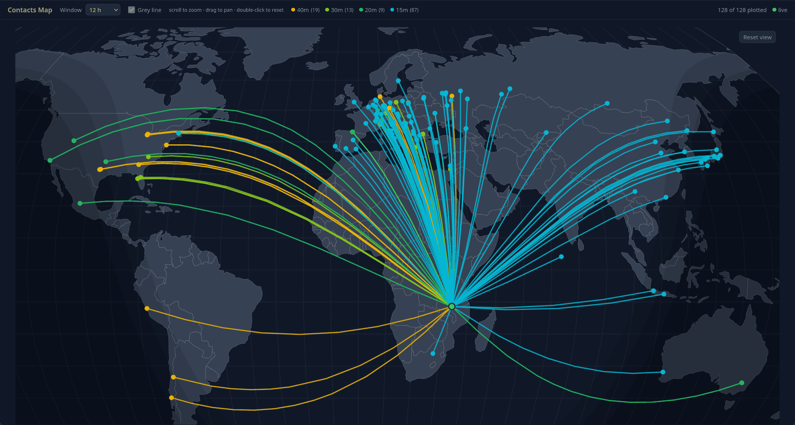
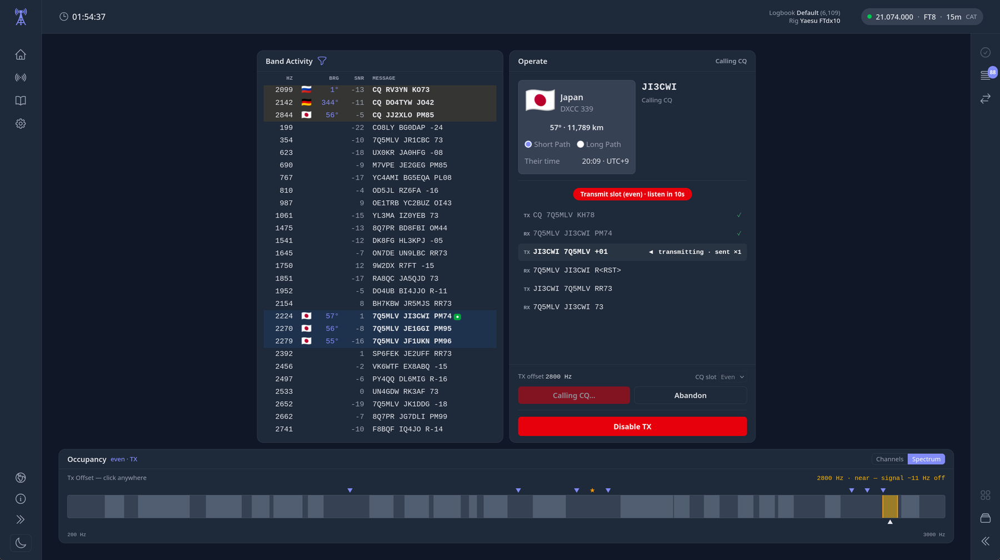

  

# Station Manager

**Amateur radio station management for Linux — logging, rig control and FT8 in one place, with no account to create and no internet needed to operate.**

🌐 **[station-manager.org](https://station-manager.org)** · 📦 [Install guide](docs/install.md) · 📄 [GPL-3.0-only](#licence)

Station Manager runs as a local daemon (`smd`, written in Go) that serves a browser UI (Svelte 5 + Vite). The daemon and the UI ship as a **single binary** — install it, point a browser at `localhost:8080`, and you have a logging station. No desktop application, no cloud account, and nothing phoning home.

> **Status: v2 alpha.** It is dogfooded daily from 7Q5MLV in Malawi and logs real contacts on
> real hardware, but it is early software with one primary operator. Expect rough edges, and
> read the [install guide](docs/install.md) before depending on it.

  
   
  <em>128 contacts in 12 hours from 7Q5MLV, coloured by band, with the grey line live.</em>

---

## What it does

**Logging**

- Fast SSB/CW entry with live callsign enrichment (QRZ.com, QRZCQ and hamnut lookups). QRZCQ XML
  is an opt-in fallback that uses a premium account session; enrichment is fail-soft by design —
  a lookup that fails degrades the entry, it never blocks the QSO.
- Full ADIF data model, `HH:MM:SS` time precision, multiple logbooks.
- Session view with in-place editing, ADIF export and session email-out.
- Contacts map — great-circle paths with a live grey-line overlay.

**FT8**

- Live decode with band activity, per-CQ **beam heading**, country flags and worked-before marking.
- Answer a CQ, work a caller, or run CQ and auto-work a pile-up.
- Occupancy view (channels or spectrum) so you pick a clear transmit slot.
- ARRL Field Day exchanges, and reduced type-4 ladders for compound calls (`PJ4/NA2AA`).
- Optional PSK Reporter spotting.

  
   
  <em>Working Japan on 15 m. Band activity carries the beam heading for every CQ; the
  ladder shows the exchange as it happens.</em>

**Rig control (CAT)**

- Frequency, mode, VFO and band control over serial, with rig state pushed live to the UI.
- FT8 keys the rig through the same guarded path, with a hard stop that survives a lost link.

**Getting QSOs out**

- Automatic forwarding to **QRZ.com**, **ClubLog**, and **QRZCQ**, per destination and configurable.
- **SM Cloud** — an optional, self-hosted off-site backup of your log, so a dead disk is not a
  lost logbook.
- All of it is opt-in. The local database is always the authority.

## Why another logger?

Honestly: what is out there did not let me operate the way I want to. I do not generally use
Windows and I do not want to use a Mac, so I was left writing it myself. Many of the existing
packages work, but look out of date, cost too much, or have UIs busy enough to make setup a chore
rather than a pleasure. This one is opinionated — deliberately.

**It has to work without the internet.** Here in Malawi the connection is not always available,
and when it is, it is not always reliable. Everything that matters happens locally: logging, rig
control, FT8, the database. Online logbooks are a bonus that syncs when there is a link — never a
requirement.

**FT8 is built in, not bolted on.** No second application, no UDP bridge, no parallel logbook to
reconcile afterwards: decoding, the exchange, rig control and logging are one program sharing one
database. A contact worked on FT8 lands in the same log, with the same callsign enrichment and on
the same map, as one worked on SSB.

Contesting is not the target today — general HF by SSB, CW and FT8 is — though support is
planned, including multiple distributed stations.

## Requirements

- An RPM-based Linux with `systemd`: **Fedora 34+, RHEL/Rocky/AlmaLinux 8+**, or recent openSUSE.
  A Debian/Ubuntu package is on the roadmap but not yet available.
- A web browser. That is the entire UI.
- For CAT and FT8: a supported rig and a sound interface.

The daemon binds **loopback only** (`127.0.0.1:8080`) and keeps all state under your home
directory — single user, single machine, no network exposure by default.

Install and first-run setup: **[`docs/install.md`](docs/install.md)**.

## Computer Aided Transceiver (CAT)

CAT is supported, but only the **Yaesu FTdx10**, **Yaesu FT-710** and **Icom IC-7300** have been
tested — those are the rigs I own. Rigs are described by data files rather than code, so adding
one does not need a new build. Definitions and reports from other operators are welcome.

## Documentation

- **[Install and first run](docs/install.md)** — from a fresh machine to your first logged QSO.
- **[Documentation library](docs/README.md)** — the generated live-document map by audience,
  class, and topic, plus routes into historical decisions and reviews.
- **[Contributor and coding-agent guidance](AGENTS.md)** — project rules, safety constraints,
  focused verification, and how to load only the context relevant to a change.
- Architecture decisions live under [`docs/decisions/`](docs/decisions/).

## Licence

Station Manager is licensed under the **GNU General Public License, version 3 only**
(`GPL-3.0-only`) — see [`LICENSE`](LICENSE) and [`NOTICE`](NOTICE).

It was MIT-licensed until 2026-05-31. The move to GPL-3.0-only follows from the FT8 decode path:
that capability comes from the companion library [go-ft8](https://github.com/ColonelBlimp/go-ft8),
a WSJT-X/jt9-derived work that is GPL-3.0-only. Linking it makes the combined work a GPLv3
derivative, so the whole project adopts the same copyleft licence. The reasoning is recorded in
[`docs/decisions/0023-relicense-to-gplv3.md`](docs/decisions/0023-relicense-to-gplv3.md) and
[`docs/licensing.md`](docs/licensing.md).

---

*73 de 7Q5MLV*
